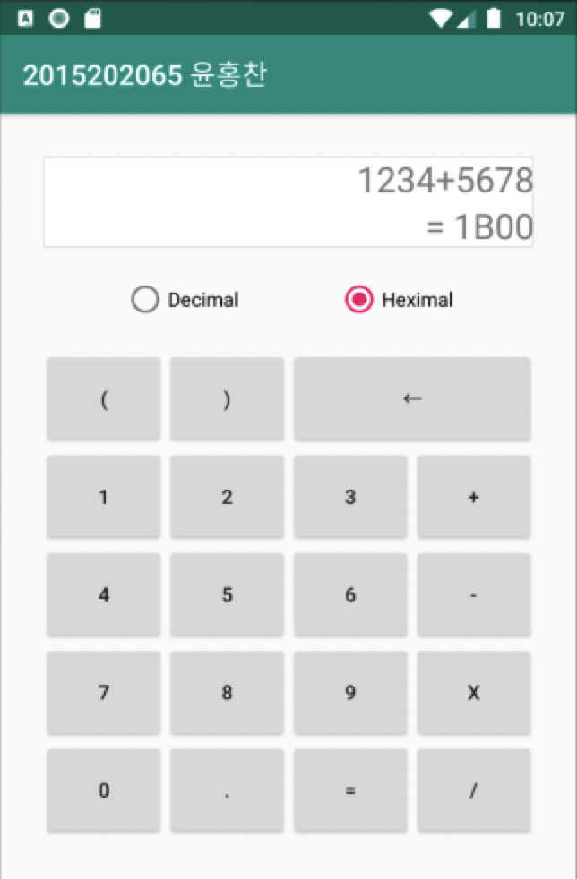

## Calculator Android App (계산기 어플)

&nbsp;&nbsp;&nbsp;&nbsp;&nbsp;&nbsp;&nbsp;&nbsp;&nbsp;&nbsp;&nbsp;&nbsp;&nbsp;&nbsp;&nbsp;&nbsp;&nbsp;&nbsp;&nbsp;&nbsp;&nbsp;&nbsp;&nbsp;&nbsp;&nbsp;&nbsp;&nbsp;&nbsp;&nbsp;&nbsp;&nbsp;&nbsp;&nbsp;&nbsp;&nbsp;&nbsp;&nbsp;&nbsp;&nbsp;&nbsp;&nbsp;&nbsp;&nbsp;&nbsp;&nbsp;&nbsp;&nbsp;&nbsp;&nbsp;&nbsp;&nbsp;&nbsp;&nbsp;&nbsp;&nbsp;&nbsp;&nbsp;&nbsp;&nbsp;&nbsp;*2019-2 심화전공실습 프로젝트*

**안드로이드 계산기 어플 구현**

 

- **구현한 기능 소개**
  - 덧셈, 뺄셈, 곱셈, 나눗셈 연산
  - 괄호 및 소수점 연산
  - 연산 결과 10진수 / 16진수 표기

 

- **사용한 언어**
  + Java

 

+ **개발 환경**
  + macOS Catalina
  + Android Studio

 

- **스크린샷**

  </img>

---

> 2020.1.1 최종 업데이트
>
> 광운대학교 소프트웨어학부 윤홍찬

